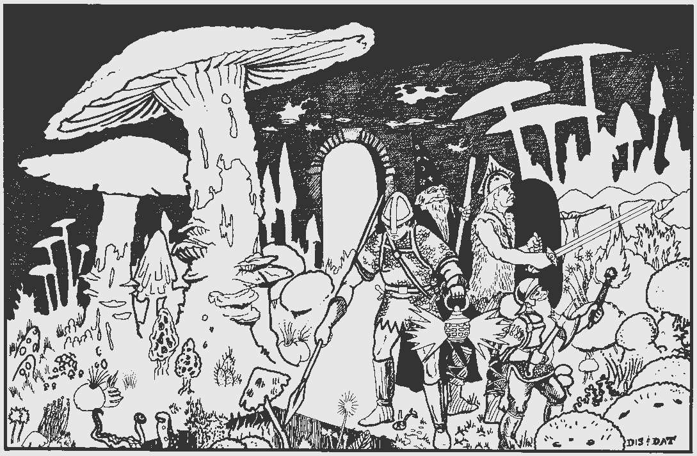

# `INT` and `WIS` in software development

We tend to think of software engineering as a discipline that requires a lot of smarts.

In the popular imagination, the programmer is a paragon of nerds, gifted with a special intelligence that makes the inner workings of a computer open to them and inscrutable to everyone else. Even within the industry, we often treat software engineering problems as puzzles that only raw brainpower to solve. In this imagining, the most effective teams are made up of engineers who think harder and faster than anyone else.

This feels wrong, however: first, because it misunderstands intelligence as something like horsepower in an engine, scaling linearly and applicable to any problem, and second, because experience shows that _sometimes the smartest developers are the least effective._

To understand why this might be the case, it helps to consider the difference between **intelligence** and **wisdom** – at least, as they're defined in [Dungeons and Dragons](https://en.wikipedia.org/wiki/Dungeons_%26_Dragons).

The intersection of software engineers and Dungeons and Dragons players is large. But in case you spent more time outside than I did in middle school, I'll take a minute to explain.

In the game every character has a set of core "ability scores" that determine how good they are at certain tasks. Characters can be strong or weak, nimble or clumsy, charismatic or repulsive, and so on, all based on these ability scores.

What about a character's smarts? The game breaks this down into two ability scores. The first, **intelligence** (usually abbreviated `INT`), is defined as:

> Intelligence measures mental acuity, accuracy of recall, and the ability to reason. An Intelligence check comes into play when you need to draw on logic, education, memory, or deductive reasoning. The Arcana, History, Investigation, Nature, and Religion skills reflect aptitude in certain kinds of Intelligence checks.

This is more or less in line with how most of us would define "smarts". Education, technical skill, and raw reasoning ability are all a part of this idea of intelligence. Just substitute "arcana" with writing a complicated regex from memory.

The second ability, **wisdom** (abbreviated `WIS`), is a little different:

> Wisdom reflects how attuned you are to the world around you and represents perceptiveness and intuition. A Wisdom check might reflect an effort to read body language, understand someone’s feelings, notice things about the environment, or care for an injured person.

If intelligence is analytic and skillful, wisdom is intuitive and perceptive. A cornerstone of wisdom is _sound judgement_, which the game considers distinct from raw intelligence. Put in simpler terms, if intelligence informs _how_ to solve a problem, wisdom helps determine _what_ problems should be solved and _why_.

A useful insight of the game is that it considers `INT` and `WIS` to be distinct skills. It's entirely possibly to have a character of average or even below average intelligence, but who is gifted with deep wisdom that allows them to consistently make the right choices. Casting out to the broader fantasy genre, Tolkein's Samwise Gamgee is a good example of a "low `INT`, high `WIS`" character.

The inverse – a "high `INT`, low `WIS`" character – is so common in the sword and sorcery genre that it's become a trope. Imagine a wizard of fearsome intelligence and power, bending the world to his will with black magic. More often that not, these kinds of characters end up ensared in their own schemes, destroyed by their own hubris and magic spun out of control. Does that sound familiar?

## Dangerous bit wizards

If you've been in this business long enough, you've encountered a software engineer who fits this trope.

Some engineers are really, really smart. They learn faster, fit a lot of information in their heads, and can just do things that perfectly average engineers (like me) couldn't hope to do, at least not as easily.

Pretty often however, these same engineers can't get out of their own way. Sometimes, in pursuit of an ideal solution, they bikeshed so long that they never get around to building anything. Or worse, they rush headlong into a solution without stopping to think, overestimating their ability to solve it on the fly. Often they design systems that are needlessly complex, and later find out that their clever approach has hidden problems, or is too costly to maintain. Habits that are bad enough when this kind of engineer works alone are made worse in a team context – if the brilliant engineer can barely manage what they've built, how will their teammates do it?

In short, this engineer has very high `INT` but not enough `WIS`. They have the smarts needed to wrestle with the most challenging problems, but they don't have the _judgement_ to do it well.

## Traps for smart people

Why does this happen? I think these wizards fall into a couple familiar traps.

__First, very smart engineers are often too comfortable with complexity__. If you're a simple [grug brained developer](https://grugbrain.dev/) like me, you fear complexity. Complexity is the great enemy that inevitably accumulates in any piece of software once it reaches a certain age and size. Complexity slows us down by making our systems harder to change and reason about, and it decreases code quality by making it easier to introduce bugs and harder to detect them. Managing complexity means accepting necessary complexity while fighting _unnecessary_ complexity wherever we can.

When an engineer has high `INT` but low `WIS`, this fear of complexity is not as strongly developed. They're more comfortable with complexity because they can be better at managing it than other engineers – their personal threshold for "too complex" is just higher. Danger begins when this sense of comfort veers into overconfidence. An engineer who is too clever by half builds systems that are difficult to understand and work with. They set traps for themselves and others.

__Second, these engineers are likely to fall in the trap of tool obsession.__ Most engineers are particular about the tools they use. They have preferred programming languages, coding paradigms, build systems, text editors, and so on. The smartest engineers can refine these preferences to an obsessive degree. This can be a good thing – some of the best tools emerged because passionate people were highly motivated to build them – but it can also become an unproductive distraction.

Most professional software organizations don't use the "best" tools. They're usually locked into a set of choices that are either impossible to change, or not worth the cost of changing. Managing a professional technology stack often comes down to choosing tools that are _good enough_ for what a team needs to do.

This compromise can make the smartest engineers very uncomfortable. They don't like being told to use technologies they deem inferior, and they assume the benefits of adopting their preferred tools will always outweigh the switching cost. They are often wrong.

Years ago I worked for a company that originally ran on a crusty PHP monolith. To escape the hell that is modern PHP development, a faction of our engineering team adopted and heavily promoted [Scala](https://en.wikipedia.org/wiki/Scala_(programming_language)) as the foundation of an alternative technology stack. I like and still like Scala – learning it made me a better software engineer – but the wizards quickly started to lose control of their magic. A subset of my very smartest coworkers concluded it wasn't enough to switch languages, everyone had to relearn how to program from first principles. Knowledge of certain branchs of [advanced mathematics](https://en.wikipedia.org/wiki/Category_theory) was now required to build software the "right" way. Significant time and energy was spent building frameworks and porting old code to use the new patterns, which were intuitive only to a minority of engineers in the organization. In the meantime, another faction grew so frustrated that they adopted a completely different programming language which a much lower barrier to entry. That language was Typescript, now probably the industry's _lingua franca_, while Scala is relegated to a curiosity.

This pattern is so common that it's a big part of what drives the technology hype cycle. Early adopters of any new tool are usually smart, opinionated, and the least likely to recognize the ways in which their tool may be flawed. In general, you should be wary of any technology trend whose boosters present it as the solution to almost _any_ problem, rather than acknowledge that picking the right tool is _context dependent_. This is how high `INT`, low `WIS` engineering plays out at industry scale.

## Cultivating wisdom

If there's any lesson to take from this, it's that raw technical skill is often not nearly as important as sound technical judgement. Both in game and in the real world, the most powerful wizards can be bested by simpler minds that make sounder choices.

The good news is that while raw intelligence is often something you're just born with, wisdom is not an innate quality and can be cultivated. One of the key differences between late and early career software engineers is their depth of technical judgement, something that improves over years of making good (and bad) decisions and seeing what works.

If you're lucky enough to be a very high `INT` software engineer, it's worth being honest with yourself and assess your `WIS`. Do you fit the trope of the dangerous bit wizard? Many of the smartest engineers start their careers in this mode, but the very best grow out of it as their wisdom matures. If, on the other hand, you're a mere mortal when it comes to `INT`, recognizing the importance of `WIS` can be a revelation. It makes it easier to resist the temptation to constantly compare yourself to the smartest engineers, which feeds [imposter syndrome](https://en.wikipedia.org/wiki/Impostor_syndrome). Wisdom provides a clear path for growth that goes beyond mere technical mastery, and an escape from the stereotype that all programmers need to be wizards. It's just as rewarding to play as a wise monk.

[← Back](https://olmsted.io) | [↑ Top](#top)
